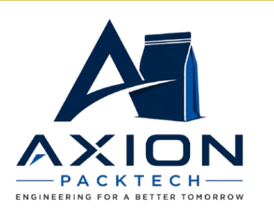

# AXION PackTech — Industrial Packaging, Automation & Machinery Platform

<div align="center">



**Next-Generation Industrial Packaging Machinery, Bulk Bagging Lines & Robotic Automation Systems**

[](https://nextjs.org/)
[](https://react.dev/)
[](https://www.typescriptlang.org/)
[](https://nodejs.org/)
[](https://expressjs.com/)
[](https://www.mongodb.com/)
[](https://www.cloudflare.com/)
[](https://tailwindcss.com/)

</div>

---

## 🏭 Overview

**AXION PackTech** is an industrial engineering solutions manufacturer specializing in advanced packaging machinery, bulk bagging lines, high-speed container handling, and end-of-line robotic automation.

This repository contains the complete full-stack web application and content management system for AXION PackTech, engineered for high performance, top-tier security, and dynamic content management.

---

## 🏗️ Repository Structure

```
Axion-Pack-Tech-2/
├── backend/                      # Node.js + Express + TypeScript API Server
│   ├── src/
│   │   ├── config/               # Database, Redis & Cloudflare R2 configurations
│   │   ├── controllers/          # Business logic & route handlers
│   │   ├── middleware/           # Turnstile verification, auth, rate limiting & multer
│   │   ├── models/               # Mongoose schemas & MongoDB models
│   │   ├── routes/               # API endpoint routing (/api/v1/*)
│   │   ├── services/             # Turnstile, R2 storage, email & cache services
│   │   ├── utils/                # JWT, logger, and helper utilities
│   │   └── validators/           # Zod schema validation rules
│   ├── tests/                    # Jest + Supertest integration & security tests
│   ├── .env.example              # Safe template for backend environment variables
│   ├── Dockerfile                # Production container configuration
│   ├── docker-compose.yml        # Multi-container setup (MongoDB, Redis, API)
│   └── package.json
│
├── client/                       # Next.js 16 (App Router) + React 19 + Tailwind v4
│   ├── src/
│   │   ├── app/                  # Next.js App Router pages and layouts
│   │   │   ├── admin/            # Protected Admin CMS dashboard & managers
│   │   │   ├── careers/          # Career portal & candidate application flow
│   │   │   ├── contact/          # Contact & RFQ inquiry system
│   │   │   ├── products/         # Dynamic 3-tier product catalog
│   │   │   └── (content)/        # Industries, Services, News, Blogs, About Us
│   │   ├── components/           # Reusable UI, Layout, Form & CMS components
│   │   │   ├── common/           # HumanVerification (Turnstile), Modals, DynamicHero
│   │   │   ├── contact/          # ContactForm and inquiry components
│   │   │   └── careers/          # CareerApplicationForm and job cards
│   │   ├── hooks/                # Custom React state & data hooks
│   │   ├── lib/api/              # Typed client-side and server-side API clients
│   │   └── types/                # TypeScript interfaces and entity types
│   ├── public/                   # Static assets, logos, and icons
│   ├── .env.example              # Safe template for frontend environment variables
│   └── package.json
│
├── .gitignore                    # Comprehensive exclusion for secrets & build outputs
└── README.md                     # Project documentation & setup guide
```

---

## 🛡️ Security Architecture & Cloudflare Turnstile Integration

All public data submission workflows are protected against automated bots, spam, and abuse:

1. **Cloudflare Turnstile Human Verification**: Every public form obtains an interactive or invisible Turnstile challenge token.
2. **Backend Siteverify Verification**: The backend independently validates every submission token with `https://challenges.cloudflare.com/turnstile/v0/siteverify`.
3. **Imperative Reset Cycle**: When verification fails or expires, widgets automatically reset and clear stale tokens.
4. **Honeypot Trap Fields**: Invisible honeypot fields (`hp_website`) trap simple crawler bots immediately.
5. **IP Rate Limiting & Duplicate Prevention**: In-memory and Redis throttlers block rapid-fire duplicate submissions.
6. **Server-Side Data Sanitization**: Recursive null-byte stripping and string trimming prevent injection vectors.
7. **Protected Admin Endpoints**: All CMS mutation and management endpoints require JWT authentication and Role-Based Access Control (`admin` or `editor`).

### Public Form Protection Matrix

| Form Name | User Action | Frontend Component | Backend Route | Protection Layer |
| :--- | :--- | :--- | :--- | :--- |
| **Contact & RFQ Inquiries** | General inquiry, quote request, engineering spec inquiry | `ContactForm.tsx` | `POST /api/v1/contact` | Turnstile + Honeypot + Rate Limiter |
| **Catalog PDF Lead Gating** | Technical brochure & machine datasheet download | `CatalogLeadModal.tsx` | `POST /api/v1/catalog-leads` | Turnstile + Honeypot + Rate Limiter |
| **Career Job Applications** | General job application with candidate CV upload | `CareerApplicationForm.tsx` | `POST /api/v1/careers/apply` | Turnstile + Honeypot + Multer Check |
| **Role-Specific Applications**| Position-targeted application (e.g. `/careers/jobs/[slug]/apply`) | `CareerApplicationForm.tsx` | `POST /api/v1/careers/:slug/apply` | Turnstile + Honeypot + Multer Check |

*Note: Informational content pages (`/about-us`, `/news`, `/blog`, `/services`, `/industries`, `/products`) remain clean and do not execute unnecessary Turnstile challenges.*

---

## ⚡ Tech Stack & Technologies

### Frontend
- **Framework**: [Next.js 16 (App Router)](https://nextjs.org/)
- **UI Library**: [React 19](https://react.dev/)
- **Language**: [TypeScript 5](https://www.typescriptlang.org/)
- **Styling**: [Tailwind CSS v4](https://tailwindcss.com/)
- **Human Verification**: [Cloudflare Turnstile](https://www.cloudflare.com/products/turnstile/)
- **Icons**: [Lucide React](https://lucide.dev/)

### Backend & Infrastructure
- **Runtime**: [Node.js 22](https://nodejs.org/)
- **Framework**: [Express 4](https://expressjs.com/)
- **Database**: [MongoDB](https://www.mongodb.com/) via [Mongoose](https://mongoosejs.com/)
- **Caching**: [Redis](https://redis.io/)
- **Media & Storage**: [Cloudflare R2](https://www.cloudflare.com/developer-platform/r2/) (S3-compatible presigned direct upload pipeline)
- **Validation**: [Zod](https://zod.dev/)
- **Email Delivery**: [Nodemailer](https://nodemailer.com/) / Brevo SMTP
- **Testing**: [Jest](https://jestjs.io/) & [Supertest](https://github.com/ladjs/supertest)

---

## 🚀 Getting Started

### Prerequisites
- Node.js 20.x or 22.x
- MongoDB (local service or MongoDB Atlas)
- Redis (optional for local caching, falls back to direct database)
- npm or pnpm

---

### 1. Backend Setup

```bash
cd backend

# 1. Install dependencies
npm install

# 2. Configure environment variables
cp .env.example .env
# Edit .env with your local MongoDB URI, JWT secret, and Cloudflare credentials

# 3. Start development server (Port 5000)
npm run dev
```

The backend will start at `http://localhost:5000/api/v1` with a health check endpoint at `http://localhost:5000/api/v1/health`.

---

### 2. Frontend Setup

```bash
cd client

# 1. Install dependencies
npm install

# 2. Configure environment variables
cp .env.example .env.local
# Edit .env.local with your Next.js public API URL and Turnstile site key

# 3. Start development server (Port 3000)
npm run dev
```

The frontend will be available at `http://localhost:3000`.

---

## 🐳 Docker Deployment

To launch the full stack (API, MongoDB, Redis) with Docker Compose:

```bash
cd backend
docker-compose up -d --build
```

---

## 🧪 Testing & Quality Assurance

Run the automated test suite in the backend:

```bash
cd backend

# Run all test suites
npm test

# Run Human Verification & Security tests specifically
npm test -- tests/humanVerification.test.ts
```

Build the client production bundle:

```bash
cd client
npm run build
```

---

## 🔒 Environment Variables Reference

### Backend (`backend/.env`)

| Variable | Description | Example |
| :--- | :--- | :--- |
| `PORT` | API Server Port | `5000` |
| `NODE_ENV` | Environment mode | `development` / `production` |
| `MONGODB_URI` | MongoDB connection string | `mongodb://127.0.0.1:27017/axion_packtech` |
| `REDIS_URL` | Redis connection string | `redis://localhost:6379` |
| `JWT_SECRET` | Secret key for JWT signing | `min_32_characters_secret_key` |
| `FRONTEND_URL` | Allowed CORS origin | `http://localhost:3000` |
| `TURNSTILE_SECRET_KEY` | Cloudflare Turnstile Secret Key (Backend only) | `1x0000000000000000000000000000000AA` |
| `R2_ACCOUNT_ID` | Cloudflare Account ID | `your_account_id` |
| `R2_ACCESS_KEY_ID` | Cloudflare R2 Access Key | `your_access_key` |
| `R2_SECRET_ACCESS_KEY` | Cloudflare R2 Secret Key | `your_secret_key` |
| `R2_BUCKET_NAME` | Cloudflare R2 Bucket Name | `axion-packtech-media` |
| `R2_PUBLIC_URL` | Public CDN URL for media | `https://media.yourdomain.com` |

### Frontend (`client/.env.local`)

| Variable | Description | Example |
| :--- | :--- | :--- |
| `API_BASE_URL` | Server-Side API URL | `http://localhost:5000/api/v1` |
| `NEXT_PUBLIC_API_URL` | Client-Side API URL | `http://localhost:5000/api/v1` |
| `NEXT_PUBLIC_SITE_URL` | Canonical Site URL | `http://localhost:3000` |
| `NEXT_PUBLIC_TURNSTILE_SITE_KEY` | Cloudflare Turnstile Site Key | `1x00000000000000000000AA` |
| `NEXT_PUBLIC_R2_PUBLIC_URL` | Public Media CDN URL | `https://media.yourdomain.com` |

---

## 📄 License

© 2026 AXION PackTech. All Rights Reserved.
